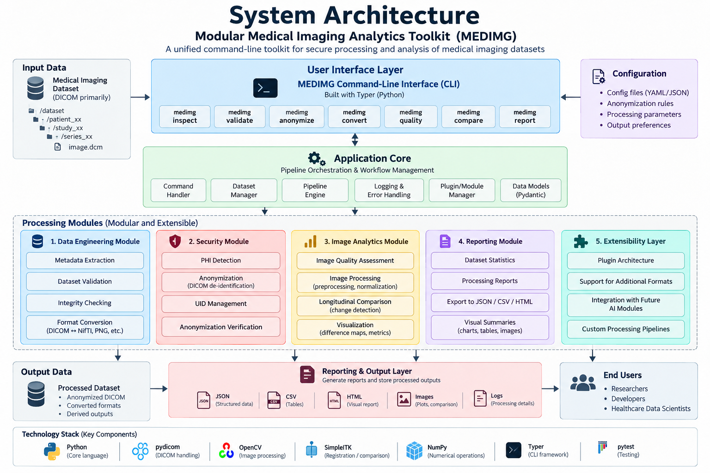

# MEDCTL Architecture

## Overview

MEDCTL is a modular, extensible Python toolkit for DICOM medical imaging dataset processing. The architecture enforces strict separation of concerns to allow independent module development and testing.

## Layered Architecture



## Module Responsibilities

### `medctl/core/`
- **`models.py`**: Pydantic data models for all domain entities (DicomFileMetadata, DatasetStats, ValidationResult, AnonymizationReport, etc.)
- **`config.py`**: YAML/JSON configuration loader with Pydantic validation
- **`dataset.py`**: Recursive directory scanner and metadata aggregator
- **`pipeline.py`**: Sequential pipeline abstraction for composable processing
- **`exceptions.py`**: Exception hierarchy (all inherit from `MedctlError`)

### `medctl/dicom/`
- **`reader.py`**: Safe DICOM file reading with preamble detection and error handling
- **`metadata.py`**: Tag extraction and type-safe normalization
- **`validator.py`**: File-level and dataset-level DICOM structural validation
- **`rules.py`**: De-identification tag classification (SAFE, REMOVE, PSEUDONYMIZE, REPLACE, REGENERATE_UID)
- **`uid.py`**: Deterministic UID mapper using keyed SHA-256 hashing
- **`anonymizer.py`**: Anonymization engine with deterministic path sanitization and policy verification

### `medctl/validation/`
- **`integrity.py`**: Streaming SHA-256 hash computation, manifest generation and verification
- **`checks.py`**: Dataset consistency checks (duplicates, UID hierarchy, modality consistency)

### `medctl/conversion/`
- **`converter.py`**: DICOM → PNG with rescale slope/intercept and windowing

### `medctl/reporting/`
- **`console.py`**: Structured terminal output (never prints raw PHI)
- **`json_report.py`**: JSON serialization with PHI sanitization safety net

### `medctl/cli/`
- **`main.py`**: Unified Typer app with subcommand registration
- **`inspect.py`**, **`validate.py`**, **`anonymize.py`**, **`convert.py`**: Individual command handlers

## Data Flow

```
Input Dataset
     │
     ▼
 scan_dataset()  →  [DicomFileMetadata]  →  DatasetStats
     │
     ├──▶ validate_dataset()  →  ValidationResult
     │
     ├──▶ generate_manifest()  →  IntegrityManifest
     │
     ├──▶ anonymize_dataset()  →  AnonymizationReport
     │         │
     │         ├── scan_phi() (pre-scan)
     │         ├── apply rules (remove/replace/pseudonymize/regenerate)
     │         ├── write output files
     │         └── scan_phi() (verify)
     │
     └──▶ convert_dicom_to_png()  →  ConversionResult
```

## Extension Points

The architecture is designed for future modules:

1. **New processing modules**: Add a new package (e.g., `medctl/quality/`) with its own models and logic
2. **New CLI commands**: Register with `app.command()` in `cli/main.py`
3. **New report types**: Add formatters to `reporting/`
4. **New file formats**: Extend `conversion/converter.py` or add new converters
5. **Pipeline composition**: Use `core/pipeline.py` to chain steps

## Design Decisions

- **Pydantic models everywhere**: Type safety, validation, and easy serialization
- **No modification of source data**: All operations produce outputs in separate directories
- **Deterministic UID mapping**: Per-session keyed hashing ensures hierarchical consistency
- **Two-pass anonymization**: Verification scan after de-identification is mandatory
- **Defence in depth for PHI**: Multiple layers prevent PHI from appearing in reports/logs
